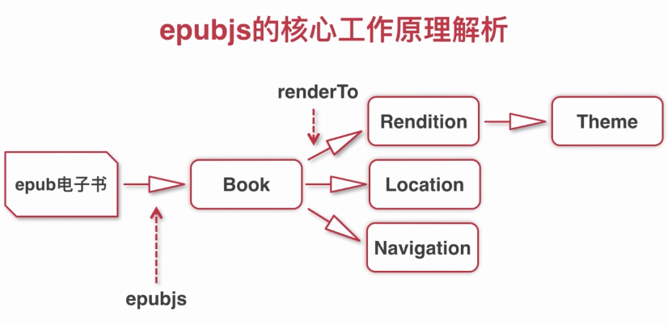

# ebook-demo

> A Vue.js project

## Build Setup

``` bash
# install dependencies
npm install

# serve with hot reload at localhost:8080
npm run dev

# build for production with minification
npm run build

# build for production and view the bundle analyzer report
npm run build --report
```
## epubjs的核心工作原理


## 踩坑与小结
- [中途遇到了这样的报错`Module build failed: TypeError: this.getResolve is not a function at Object.loader`,这个错误的原因是安装的sass-loader的版本过高，导致编译失败，查了好久的错误，醉了这也可以]

For a detailed explanation on how things work, check out the [guide](http://vuejs-templates.github.io/webpack/) and [docs for vue-loader](http://vuejs.github.io/vue-loader).
